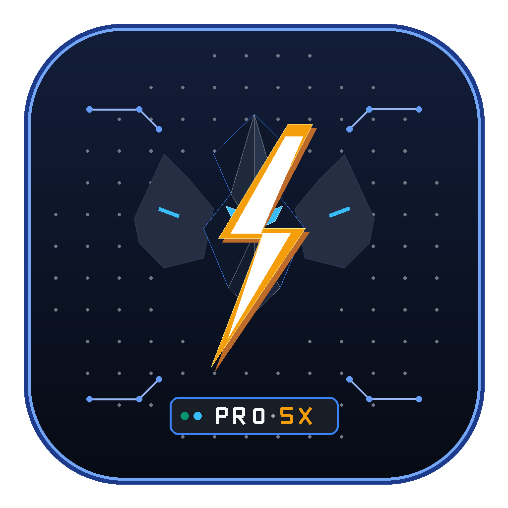
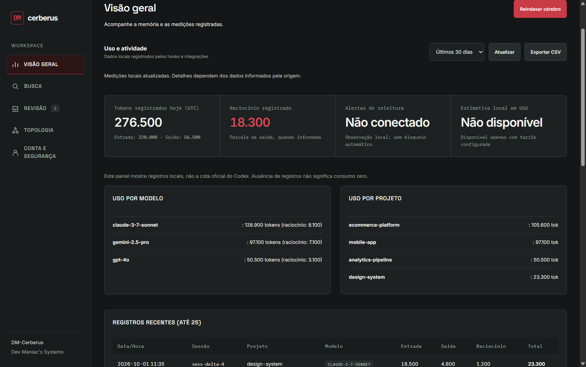
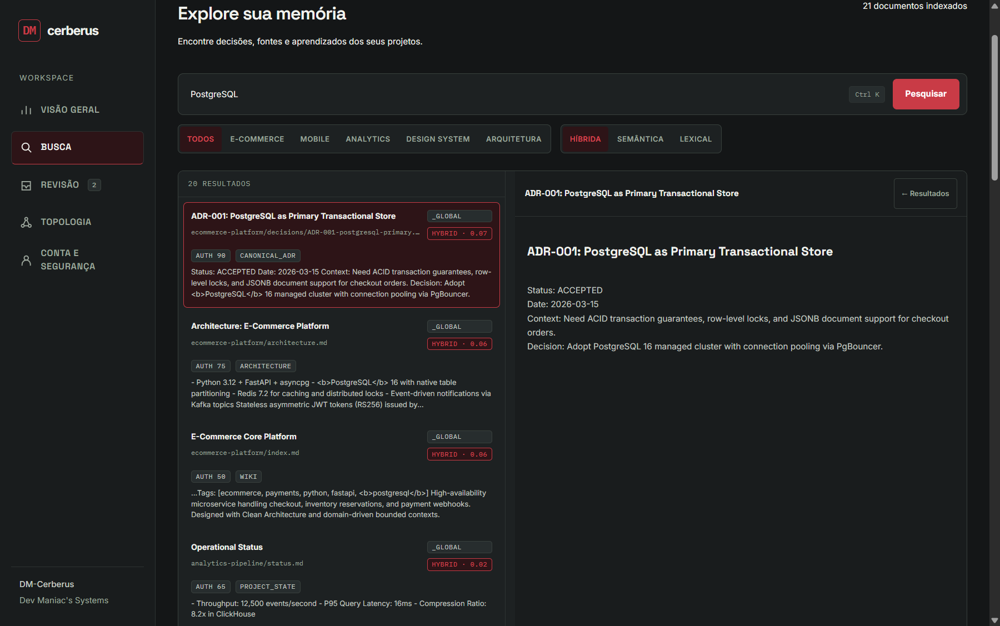
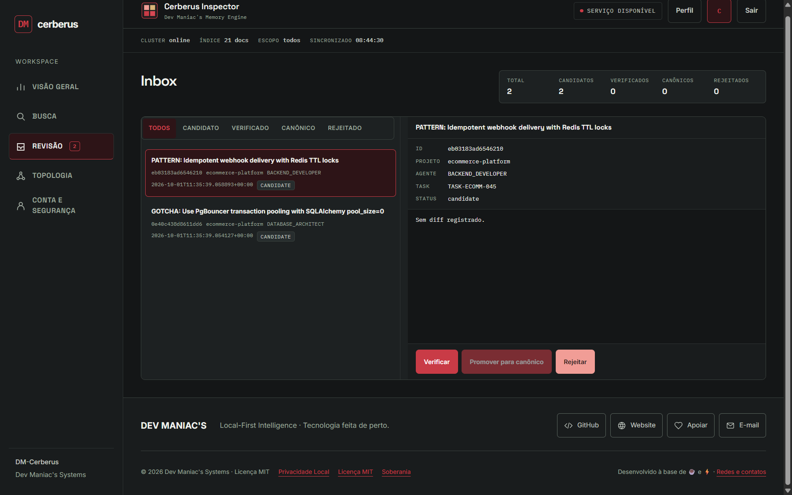
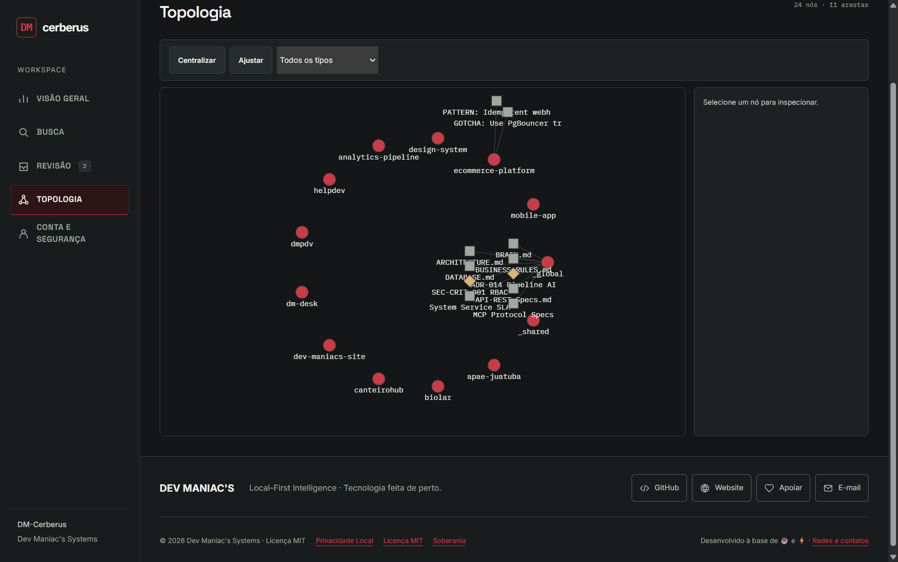
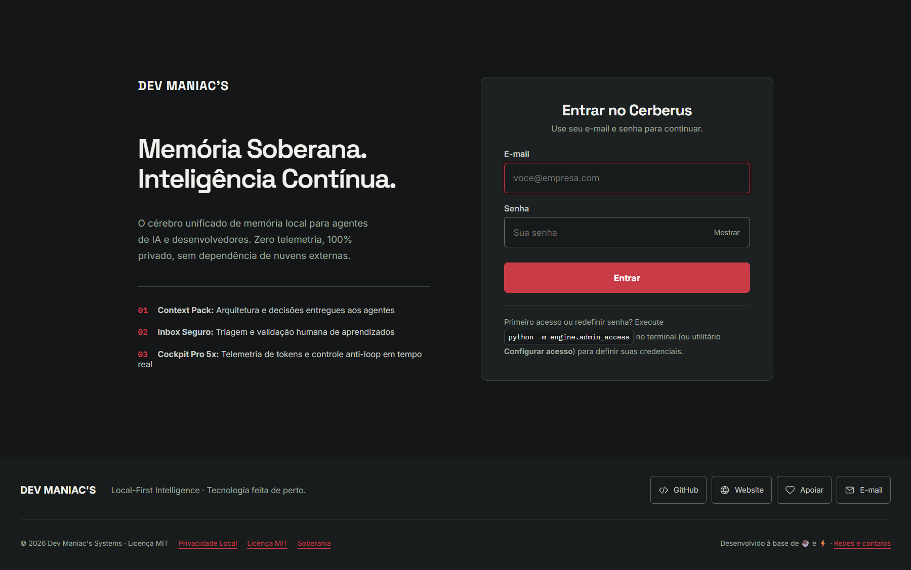
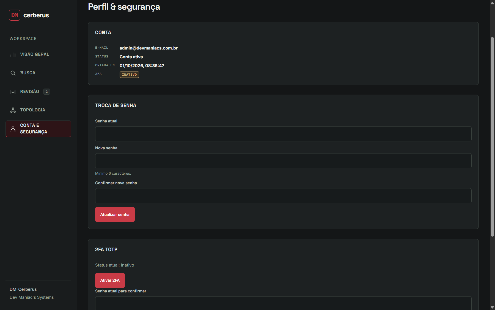

# 🧠 DM-Cerberus — Local-First Memory Intelligence & Cockpit Pro for AI Coding Assistants

<p align="center">
  <a href="https://devmaniacs.com.br/" target="_blank" rel="noopener noreferrer">
    
  </a>
</p>

<p align="center">
  <strong>The sovereign on-device memory intelligence, hybrid search engine, and token radar for AI coding agents.</strong><br>
  Built for <strong>Google Antigravity</strong>, <strong>OpenAI Codex</strong>, <strong>Claude Code</strong>, <strong>Cursor</strong>, and <strong>Windsurf</strong>.
</p>

<p align="center">
  <a href="LICENSE"></a>
  
  
  
  
  
  <a href="https://devmaniacs.com.br/"></a>
</p>

<p align="center">
  <a href="#-key-features">Key Features</a> •
  <a href="#-showcase-gallery">Showcase</a> •
  <a href="#-quickstart">Quickstart</a> •
  <a href="#-mcp-integration">Agent Setup (MCP)</a> •
  <a href="#-architecture">Architecture</a> •
  <a href="#-community--support">Support</a> •
  <a href="README.pt-BR.md">Português (Brasil)</a> •
  <a href="README.es.md">Español</a>
</p>

---

## ⚡ The Problem: AI Context Amnesia & Token Drift

When engineering complex systems with autonomous coding agents (Codex, Antigravity, Claude Code, Cursor, Windsurf), developers face critical bottlenecks:
1. **Context Amnesia:** Every new terminal session starts from scratch. Previous architectural decisions, database schemas, and bug fixes must be repeatedly re-explained.
2. **Infinite Loop Token Drain:** Agents can fall into repetitive file reading or test retry loops, consuming hundreds of thousands of tokens without progress.
3. **Cloud Privacy Leaks:** Storing project knowledge in proprietary third-party vector databases exposes your private intellectual property and sensitive codebase rules.
4. **Hallucination & Drift:** Without a curated canonical source of truth, agents make conflicting assumptions about project boundaries and dependencies.

**DM-Cerberus** solves this completely. Operating 100% locally on your machine, it acts as a persistent corporate brain and control tower.

---

## ✨ Key Features

### 🔍 1. FTS5 SQLite Hybrid Search & BM25 Authority Ranking
- Blazing-fast full-text search across Markdown documentation, ADRs, database specifications, and project rules.
- Combines **FTS5 BM25 lexical precision** with weighted authority scores (Level 10 scratch notes up to Level 50 canonical decisions).
- Sub-millisecond queries with zero cloud vector dependencies.

### 📥 2. Automated Learning Pipeline & Candidate Review Inbox
- When agents solve tricky bugs or establish patterns, they automatically propose learnings via `capture_learning`.
- Proactive **Human-in-the-Loop** verification: review diffs in the web UI, verify with one click, or promote directly into canonical memory.
- Fault-tolerant store handles corrupt or legacy payloads gracefully without service degradation.

### 📊 3. Cockpit Pro 5x & Anti-Loop Radar Engine
- Real-time token accounting for Prompt, Completion, and Reasoning tokens.
- Native pricing models for `gpt-6.1-sol`, `gpt-6-luna`, `gpt-6-astra`, `claude-3-7-sonnet`, and `gemini-2.5-pro`.
- **Anti-Loop Radar**: Detects consecutive duplicate queries and tool invocations, alerting you before tokens are burned needlessly.
- Export detailed session telemetry to CSV for auditing and cost control.

### 🌐 4. Interactive System & Memory Topology Canvas
- Visual 2D force-directed knowledge graph mapping the connections between your projects, core documents, architecture decisions, and agents.
- Interactive node inspection, zoom, and pan powered by hardware-accelerated HTML5 Canvas.

### 🛡️ 5. Enterprise Security & Local-First Sovereignty
- **100% On-Device:** Data never leaves `127.0.0.1`. No telemetry, no third-party tracking.
- **PBKDF2-HMAC-SHA256** password hashing with 200,000 iterations.
- **RFC 6238 TOTP 2-Factor Authentication** (Google Authenticator, Authy, 1Password).
- Cryptographically signed HMAC-SHA256 session cookies.

### 🔌 6. Multi-Agent Model Context Protocol (MCP) Server
- Turnkey integration with **Anthropic MCP** standard.
- Plug DM-Cerberus into Codex, Antigravity, Claude Code, Cursor, Windsurf, or custom LangFlow/CrewAI workflows.

---

## 📸 Showcase Gallery

| Cockpit Pro 5x & Token Radar | FTS5 Hybrid Search & Preview |
|:---:|:---:|
|  |  |

| Candidate Review Inbox | Interactive Memory Topology |
|:---:|:---:|
|  |  |

| Sovereign Login & Dev Maniac's Theme | Account & 2FA Security |
|:---:|:---:|
|  |  |

---

## 🚀 Quickstart

### Option A: Direct Python (Recommended)

1. **Clone the repository:**
   ```bash
   git clone https://github.com/HelbertMoura/DM-Cerberus.git
   cd DM-Cerberus
   ```

2. **Index your project memory:**
   ```bash
   python -m engine.cli index
   ```

3. **Launch the Cockpit Dashboard:**
   ```bash
   python -m engine.cli ui --port 8765
   ```
   Open `http://127.0.0.1:8765` in your browser.

4. **Desktop Launcher (Windows):**
   Double-click `bin/launch_cockpit.pyw` or run `bin/launch_cockpit.cmd` to start silently in the background with a native desktop shortcut.

---

### Option B: Docker Compose

```bash
cp .env.example .env
# Edit .env with your desired admin credentials and secret key
docker compose up -d
```
Access the dashboard at `http://127.0.0.1:7331`.

---

## 🤖 Multi-Agent Setup (MCP)

Connect DM-Cerberus to your favorite AI assistant using standard MCP configuration:

### 1. Google Antigravity / Gemini CLI
Add to your `mcp_servers.json`:
```json
{
  "mcpServers": {
    "cerberus-memory": {
      "command": "python",
      "args": ["-m", "engine.cli", "mcp"],
      "cwd": "C:/path/to/DM-Cerberus"
    }
  }
}
```

### 2. Claude Code (`~/.claude/config.json`)
```json
{
  "mcpServers": {
    "cerberus": {
      "command": "python",
      "args": ["-m", "engine.cli", "mcp"],
      "cwd": "/path/to/DM-Cerberus"
    }
  }
}
```

### 3. Cursor & Windsurf (`cursor_mcp.json` / `settings.json`)
```json
{
  "mcpServers": {
    "cerberus-memory": {
      "command": "python",
      "args": ["-m", "engine.cli", "mcp"],
      "cwd": "/path/to/DM-Cerberus"
    }
  }
}
```

### Available MCP Tools

| Tool | Description |
|:---|:---|
| `cerberus_search_memory` | BM25 + FTS5 full-text search across documentation and decisions |
| `cerberus_get_context_pack` | Instant architectural bundle for a specific project or task |
| `cerberus_get_decisions` | Filter recorded Architecture Decision Records (ADRs) |
| `cerberus_capture_learning` | Submit a candidate learning or pattern to the human review inbox |
| `cerberus_save_task_state` | Persist current progress, plan, and blockers across sessions |
| `cerberus_get_task_state` | Restore task execution state from a previous agent session |

---

## 🏗️ Architecture

```
                      ┌────────────────────────────────────────┐
                      │    AI Agents & Coding Assistants       │
                      │ (Antigravity · Codex · Claude · Cursor)│
                      └──────────────────┬─────────────────────┘
                                         │ JSON-RPC (MCP)
                                         ▼
┌─────────────────────────────────────────────────────────────────────────────┐
│                             DM-Cerberus Engine                              │
│                                                                             │
│  ┌───────────────────────┐  ┌───────────────────────┐  ┌─────────────────┐  │
│  │   SQLite FTS5 Index   │  │ Candidate Inbox Store │  │  Token Ledger   │  │
│  │   (BM25 Hybrid RAG)   │  │  (Human-in-the-Loop)  │  │ & Anti-Loop Pro │  │
│  └───────────────────────┘  └───────────────────────┘  └─────────────────┘  │
│                                        ▲                                    │
│                                        │ HTTP REST / Session Auth           │
│                                        ▼                                    │
│  ┌───────────────────────────────────────────────────────────────────────┐  │
│  │                    Web Cockpit Workbench (Port 8765)                  │  │
│  │  [Visão Geral]   [Busca & Preview]   [Inbox]   [Topologia]   [Perfil] │  │
│  └───────────────────────────────────────────────────────────────────────┘  │
└──────────────────────────────────────┬──────────────────────────────────────┘
                                       │ Local File Storage
                                       ▼
                      ┌────────────────────────────────────────┐
                      │  Local Repository / .cerberus / SQLite │
                      │  (100% Sovereign · Zero Cloud Leaks)   │
                      └────────────────────────────────────────┘
```

---

## 🧪 Testing & Verification

The DM-Cerberus test suite guarantees reliability and zero regressions:
```bash
python -m pytest tests/
```
Output:
```
tests/test_ui_hardening.py .................................... [ 60%]
tests/test_server_api.py ........................               [100%]
============================= 60 passed in 15.18s =============================
```

---

## 📜 License

Distributed under the **MIT License**. See [LICENSE](LICENSE) for details.

---

## ☕ Community & Support

**DM-Cerberus** is created with ☕ and ⚡ by **Helbert Moura** and the **Dev Maniac's Systems** team.

- 🌐 **Official Website:** [devmaniacs.com.br](https://devmaniacs.com.br/)
- 🤝 **Support & Sponsorship:** [linktr.ee/helbertmoura](https://linktr.ee/helbertmoura)
- 🚀 **Sister Project:** [AI Launcher](https://github.com/HelbertMoura/ai_launcher)
- 🐛 **Issue Tracker:** [GitHub Issues](https://github.com/HelbertMoura/DM-Cerberus/issues)
