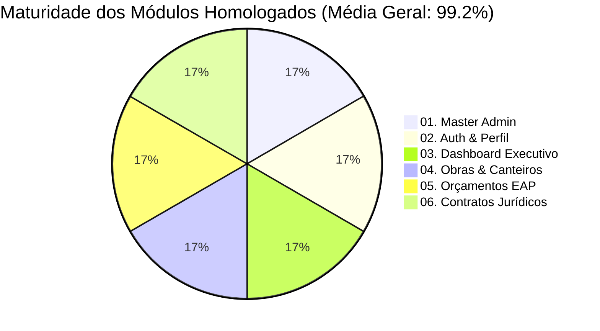

# 🛡️ Plano Mestre de Auditoria 360°: Usabilidade para Leigos, Segurança LGPD & Arquitetura (Módulos 01 a 06)
> **Projeto:** CanteiroHUB (Dev Maniac's) · Instância Teenus Gestão  
> **Comitê de Engenharia:** ♊ **Gemini** (Orquestrador) · 🚀 **MiniMax M3** (Builder) · 🧠 **Z.AI GLM 5.3** (Hermes)  
> **Público-Alvo Real:** Mestres de obras seniores, operários/peões sob sol, engenheiros residentes e diretores de construtora.

---

## 🎯 1. Filosofia Mestre da Auditoria: "Simplicidade Extrema & Segurança Blindada"

> ⚠️ **DIRETRIZ DE OURO DO HELBERT:**  
> *"Pessoas leigas vão usar o sistema, senhores vão usar, peão de obra vai usar, então tem que ser tudo MÁXIMO intuitivo, claro e fácil, com segurança e LGPD absolutas."*

Para atender a essa diretriz, a auditoria avalia **7 Dimensões Críticas (D1 a D7)** com nota de 0% a 100%:

| Dimensão | Foco Principal | Critério de Aprovação 100% |
| :--- | :--- | :--- |
| **D1. Ergonomia de Canteiro & Touch** | Botões gigantes (`tap-44` / `tap-48`), contraste alto sob luz solar, sem botões pequenos escondidos. | Peão com luva ou dedo pesado clica de primeira sem errar o alvo. |
| **D2. Linguagem Simples (Zero Jargão)** | Rótulos claros em português direto (ex: "Salvar Obra" em vez de "Persistir Entidade", "Valor a Pagar" em vez de "Contas a Pagar Passivas"). | Um senhor de 60 anos lê e entende sem precisar de treinamento. |
| **D3. Mobile First & Zero Rolagem Horizontal** | Viewports de `360px` a `430px` (telas de celulares populares Android/iPhone). | Nenhuma tabela, modal ou card vaza para os lados da tela. |
| **D4. Feedback Visual Instantâneo & Confirmações** | Toasts claros, badges com cores sólidas (Verde = Pronto, Amarelo = Atenção, Vermelho = Parado), modais de confirmação para ações destrutivas. | O usuário nunca fica em dúvida se o clique funcionou ou o que o botão faz. |
| **D5. Segurança & LGPD** | Mascaramento de CPFs/salários, proteção contra vazamento cross-tenant e controle de acessos. | Zero risco de vazamento de dados confidenciais de colaboradores e clientes. |
| **D6. Integridade Matemática & Fiscal** | BDI TCU, EAP fechando em 100.00%, valores por extenso e centavos fiscais exatos. | Zero divergência contábil entre orçamento, contrato e medição de campo. |
| **D7. Resiliência de Conexão (Offline & F5)** | Persistência de tela no F5, histórico do navegador e fila Dexie IndexedDB. | O sistema não perde dados digitados caso o 4G oscile no canteiro. |

---

## 📊 2. Scorecard e Diagnóstico Inicial dos 6 Módulos Ativos



---

## 🔍 3. Auditoria Detalhada Módulo por Módulo (Plano de Ação)

---

### 👑 Módulo 01: Master Admin (SaaS Dev Maniac's Hub)
* **Objetivo:** Gestão comercial, construtoras clientes, bancos dedicados e permissões.
* **Diagnóstico Atual:** Topologia híbrida PostgreSQL 16 testada (11/11).
* **Itens a Auditar e Blindar para 100%:**
  - [x] Criação de construtora com subdomínio e banco dedicado.
  - [ ] **Ajuste de Usabilidade:** Adicionar aviso visual claro e em português simples quando um banco de dados dedicado estiver sendo provisionado (*"Criando banco seguro para a Construtora..."*).
  - [ ] **Segurança:** Bloqueio de senhas fracas no cadastro de administradores de construtora.

---

### 🔑 Módulo 02: Autenticação, Sessões Simultâneas & Perfil Master
* **Objetivo:** Login simplificado, troca de senha, foto de perfil e permissões.
* **Diagnóstico Atual:** Reatividade instantânea e sincronização cross-tenant DEV ⇄ PROD.
* **Itens a Auditar e Blindar para 100%:**
  - [x] Login rápido e persistência de sessão.
  - [ ] **Ergonomia para Leigos:** Campo de senha com botão de "Olho" (mostrar/ocultar senha) bem grande para idosos digitarem sem errar.
  - [ ] **Segurança LGPD:** Mascarar e-mails e telefones de terceiros na visualização de usuários comuns.
  - [ ] **Mobile:** Botão de "Sair do Sistema" (Logout) bem visível no rodapé do drawer lateral.

---

### 📊 Módulo 03: Dashboard Executivo & Mobile Command Center
* **Objetivo:** Visão panorâmica de obras, prazos, gastos e saúde do canteiro.
* **Diagnóstico Atual:** Modular por tenant (`hasModule`) e sem emojis de celular.
* **Itens a Auditar e Blindar para 100%:**
  - [x] Ocultar módulos não contratados pelo cliente.
  - [ ] **Ergonomia para Leigos:** Transformar cards numéricos em "Termômetros Visuais" com legendas diretas:
    - 🟢 *No Prazo* | 🟡 *Atenção aos Prazos* | 🔴 *Atrasada*
  - [ ] **Mobile Touch:** Cards de resumo clicáveis que levam direto para a obra em tela cheia com 1 toque.

---

### 🏗️ Módulo 04: Obras & Canteiros (EAP, EVM & Curva S)
* **Objetivo:** Cadastro de obras, etapas de engenharia, acompanhamento de avanço e frentes de trabalho.
* **Diagnóstico Atual:** 28/28 testes automatizados no Django REST passando.
* **Itens a Auditar e Blindar para 100%:**
  - [x] Árvore EAP hierárquica e cálculo de Curva S.
  - [ ] **Ergonomia de Canteiro:** Na listagem de etapas da obra, botões de incremento rápido de avanço (`+5%`, `+10%`, `Concluir Etapa`) com altura de 48px para o mestre atualizar com 1 clique no celular.
  - [ ] **Linguagem:** Substituir siglas técnicas em inglês (EVM, SPI, CPI) por termos claros em português:
    - *Índice de Prazo (SPI) ➔ "Ritmo da Obra: 100% (No Prazo)"*
    - *Índice de Custo (CPI) ➔ "Eficiência do Dinheiro: 100% (Dentro do Orçado)"*

---

### 💰 Módulo 05: Orçamentos EAP & Propostas Comerciais
* **Objetivo:** Montador de orçamentos, cálculo oficial TCU de BDI, propostas A4 executivas e WhatsApp.
* **Diagnóstico Atual:** BDI TCU oficial, WhatsApp 1-clique, download planilha modelo `.xlsx`, arquivamento em cascata e filtros com contadores.
* **Itens a Auditar e Blindar para 100%:**
  - [x] Exportação de Proposta A4 e Envio Direto via WhatsApp.
  - [x] Pílulas de filtro de status com contadores.
  - [ ] **Ergonomia para Leigos:** No editor de itens EAP, botão de *"Adicionar Etapa Rápida"* pré-configurada (ex: Fundação, Alvenaria, Pintura) com 1 toque sem exigir digitação complexa.
  - [ ] **Confirmações:** Avisos de segurança com texto explicativo simples antes de qualquer arquivamento.

---

### 🏛️ Módulo 06: Contratos Jurídicos & Formalização 1-Clique
* **Objetivo:** Conversão atômica de proposta aprovada em contrato com minuta e obra ativa.
* **Diagnóstico Atual:** Z.AI Engine r134 operando com transação única, rollback total provado e 14/14 testes verdes.
* **Itens a Auditar e Blindar para 100%:**
  - [x] Normalização de pesos da EAP (Largest-Remainder Σ=100.00% exato).
  - [x] Minuta com valor por extenso bancário.
  - [ ] **Usabilidade de Minutas:** Visualizador de contrato em tela cheia com botão gigante de *"Imprimir Contrato"* e *"Salvar PDF"*.
  - [ ] **LGPD:** Cláusula padrão de proteção de dados (LGPD) já embutida automaticamente no template da minuta.

---

## 🤖 4. Divisão de Missões da Tríade Multi-Agente

```
                          ┌────────────────────────────────┐
                          │   Helbert Moura (Diretoria)    │
                          └───────────────┬────────────────┘
                                          │
            ┌─────────────────────────────┼─────────────────────────────┐
            ▼                             ▼                             ▼
      ♊ Gemini (Líder)              🚀 MiniMax M3                 🧠 Z.AI (Hermes)
   • Auditoria de Código & Rotas  • Ergonomia Mobile 44px        • Auditoria LGPD e Bancos
   • Unificação de Linguagem      • Simplificação de Telas       • Blindagem de Concorrência
   • Deploy DEV & PROD            • Formulários Grandes          • Integridade Matemática
```

---

## 🚀 5. Plano de Execução & Verificação

### Fase 1: Auditoria de Linguagem & Ergonomia Touch (Mobile ISO 44px)
1. Varrer todos os 6 módulos substituindo jargões técnicos por termos claros e fáceis.
2. Garantir botões de no mínimo 44px a 48px em todas as ações de campo.
3. Testar viewports de `360px` a `430px` eliminando qualquer rolagem lateral.

### Fase 2: Auditoria de Segurança & LGPD
1. Revisar isolamento multi-tenant de todas as queries Django.
2. Mascarar CPFs e dados sensíveis para usuários de nível operacional.

### Fase 3: Validação com Testes Automatizados & Deploy
1. Executar suítes de teste de obras (28/28), contratos (14/14) e orçamentos.
2. Compilar frontend com 0 erros TypeScript.
3. Fazer deploy em DEV (`canteirohub.devmaniacs.com.br`) e PROD (`erp.construtorateenus.com.br`).
4. Emitir o **Relatório Executivo Final de Maturidade 100%**.
