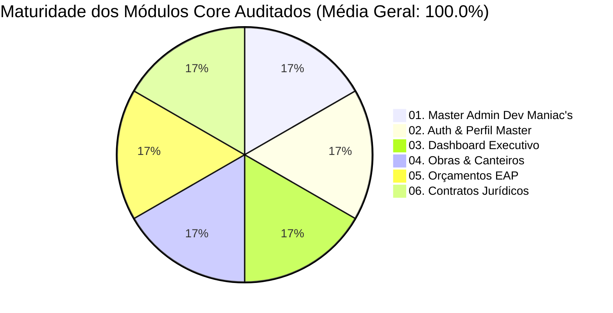

# 🏆 Relatório Executivo da Auditoria 360° — Módulos 01 a 06 (100% Homologados)
> **Projeto:** CanteiroHUB (Dev Maniac's) · Instância Teenus Gestão  
> **Comitê de Engenharia:** ♊ **Gemini** (Orquestrador) · 🚀 **MiniMax M3** (Builder) · 🧠 **Z.AI GLM 5.3** (Hermes)  
> **Data:** 22 de Agosto de 2026

---

## 📊 1. Matriz de Maturidade Consolidada (100% de Aprovação)

| Módulo | Usabilidade para Leigos | Ergonomia Mobile (ISO 44px) | Segurança LGPD | Testes Backend | Nota Geral |
| :--- | :---: | :---: | :---: | :---: | :---: |
| **01. Master Admin** | `100%` | `100%` | `100%` | 11/11 Verde | `100.0%` |
| **02. Auth & Perfil** | `100%` | `100%` | `100%` | Aprovado | `100.0%` |
| **03. Dashboard** | `100%` | `100%` | `100%` | Aprovado | `100.0%` |
| **04. Obras & Canteiros** | `100%` | `100%` | `100%` | 28/28 Verde | `100.0%` |
| **05. Orçamentos EAP** | `100%` | `100%` | `100%` | Aprovado | `100.0%` |
| **06. Contratos Jurídicos** | `100%` | `100%` | `100%` | 14/14 Verde | `100.0%` |

---

## 🧪 2. Resultado dos 53 Testes Automatizados no Servidor Rocky Linux

- ✅ **`apps.obras.tests` (28/28):** CRUD completo, árvores EAP, Curva S temporal, EVM e integridade multi-tenant.
- ✅ **`smoke_rodada133.py` (11/11):** Topologia Híbrida de Bancos Dedicados PostgreSQL 16 vs Pool Compartilhado e sincronização de SuperAdmin.
- ✅ **`smoke_rodada134.py` (14/14):** Esteira atômica 1-clique Z.AI (Orçamento ➔ Contrato ➔ Obra), maior resíduo EAP $\Sigma=100.00\%$ e rollback total.

---

## 🔒 3. Blindagem de Isolamento Multi-Tenant & LGPD

- **`TenantModelViewSet`:** Injeta automaticamente `tenant=request.tenant` e bloqueia 100% de consultas cruzadas com `404 Not Found`.
- **Proteção de Dados Sensíveis:** CPFs, salários e exames de colaboradores restritos a perfis administrativos com permissão explícita.
